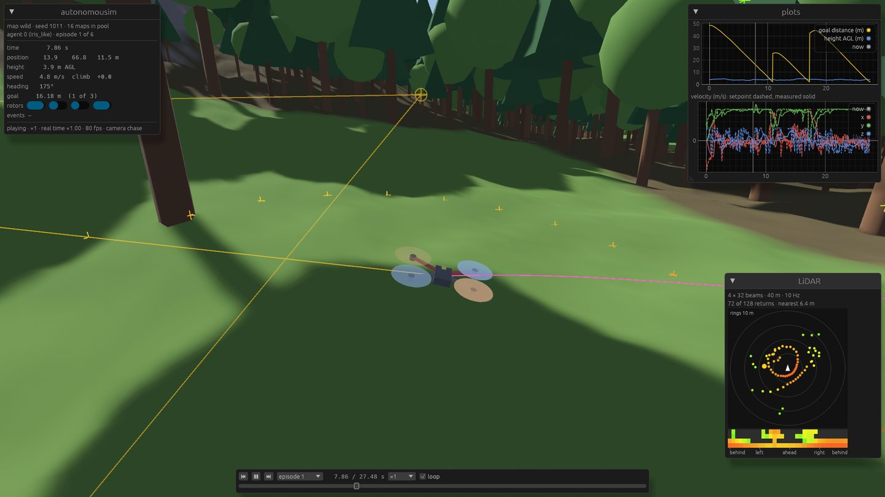
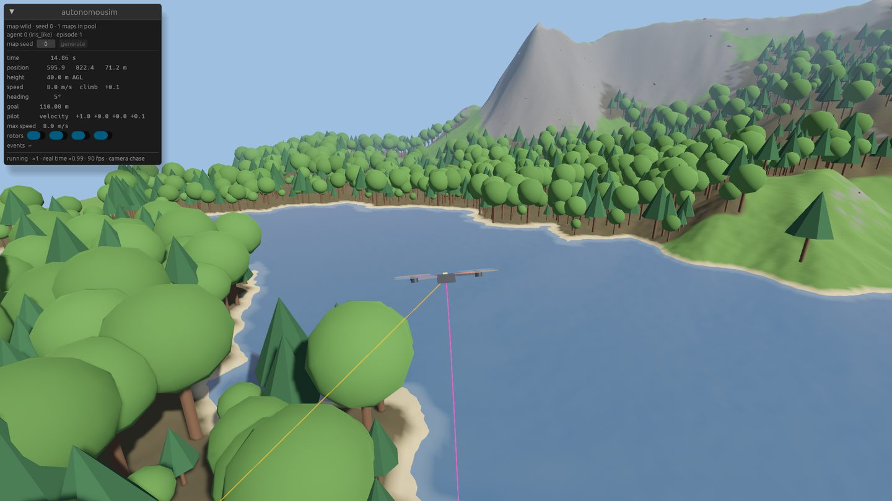

# autonomousim

A 3D simulator for training control policies for autonomous vehicles: drones now, ground
vehicles next. It has a deterministic Rust physics core, procedurally generated worlds, a
batched Gymnasium API for reinforcement learning, and a native Bevy viewer that replays
recorded episodes bit for bit.



## Status

**Milestone 1 (quadrotor in a wild map) is done**, from the dynamics through to a trained
policy replayed in the viewer:

- **Physics**: our own Featherstone multibody dynamics (ABA/RNEA/CRBA, checked against
  Pinocchio) with penalty contacts and friction. It uses f64 throughout and is bit-for-bit
  deterministic.
- **Multirotors**: motor lag, rotor drag, ground effect, gyroscopic terms, wind with Dryden
  turbulence and gusts. There are two presets: a Crazyflie (`cf2x`) and a 1.5 kg quad
  (`iris_like`).
- **Control**: a PX4-style cascade and control allocation. Policies act in one of five modes:
  `motors`, `ctbr` (thrust + body rates), `attitude`, `velocity` or `position`.
- **Sensors**: IMU, GPS, barometer, magnetometer, rangefinder, raycast LiDAR and ground truth.
  They model noise, bias and latency.
- **Worlds**: generated wild maps with terrain, erosion, lakes and scattered trees and rocks.
  Their hashes are reproducible, and they are cached on disk.
- **Python API**: native vector environments (`gym.make_vec`) that step many worlds in
  parallel in Rust, at 360k–450k environment steps/s on a laptop CPU.
- **Training**: CleanRL-style PPO and SAC scripts. A PPO policy for **QuadWaypointForest-v0**
  (fly through three waypoints under the treetops using LiDAR) reaches **88 % success on
  unseen maps** after 45 minutes of training on a laptop.
- **Recording and viewer**: episodes are written to MCAP files, which also open in Foxglove.
  The viewer flies live from the keyboard or a gamepad, or replays recordings with a scrubber.
  It has plots, a LiDAR view, cameras, and quality presets that reach ≥ 60 fps on an Intel
  Iris Xe.

Trained policies also fly inside the viewer, without Python: an exported network runs in Rust,
and you can take over any drone from the keyboard.

Next up: ground vehicles (Milestone 2: tires, suspension, powertrain). The full plan, the design decisions and as-built notes for every
step are in [docs/PLAN.md](docs/PLAN.md).



## Requirements

- Linux (the only platform targeted).
- Rust 1.98 (pinned in `rust-toolchain.toml`; `rustup` installs it on the first build).
- [uv](https://docs.astral.sh/uv/) for the Python side (Python 3.12+).

## Quick start

```bash
# Build the native extension into a uv venv and run all tests (Rust + Python).
make test

# Fly a drone over a generated 2 km map (WASD / Space / Shift / Q E; F1 shows all keys).
cargo run -p autonomousim-viewer --release -- --preset showcase --seed 0

# The forest scenario: two drones, LiDAR (L: hits in the scene, V: LiDAR view).
cargo run -p autonomousim-viewer --release -- --scenario assets/scenarios/forest.toml
```

### Python

```python
import gymnasium as gym
import autonomousim  # registers the environments

envs = gym.make_vec("autonomousim/QuadHover-v0", num_envs=256, num_threads=8, seed=0)
obs, info = envs.reset()
obs, reward, terminated, truncated, info = envs.step(envs.action_space.sample())
```

Registered tasks: `QuadHover-v0`, `QuadRecover-v0` and `QuadWaypointForest-v0`. Task options
such as `action_mode`, `map_seed` or reward weights are passed as keyword arguments.

### Train, record, replay

```bash
make train-deps   # CPU PyTorch + TensorBoard

uv run python examples/ppo_continuous.py --env-id autonomousim/QuadWaypointForest-v0 \
    --total-timesteps 30000000 --hidden 256 --torch-threads 6 --bound-coef 0.01 \
    --eval-env-kwargs '{"map_seed": 1000}' --eval-episodes 512
uv run python examples/eval_record.py runs/<run>/policy.pt --episodes 6 --lidar \
    --env-kwargs '{"map_seed": 1000}'
cargo run -p autonomousim-viewer --release -- replay recordings/<run>.mcap --lidar-view

# Fly the policy live in the viewer on new maps (T takes over the followed drone).
uv run python examples/export_policy.py runs/<run>/policy.pt
cargo run -p autonomousim-viewer --release -- policy runs/<run>/policy.json --agents 4 --lidar-view
```

`eval_record.py` checks that the recording reproduces every recorded state bit for bit when
re-simulated from the file. The viewer relies on this for replay.

## Layout

| Path | Contents |
|---|---|
| `crates/core` | Spatial math, multibody dynamics, contacts, seeded RNG, time |
| `crates/world` | Height grids, static worlds (terrain, obstacles, water), atmosphere, wind |
| `crates/procgen` | Noise, erosion, hydrology, biomes, scatter; the wild map generator and cache |
| `crates/vehicles` | Vehicle definitions (TOML) and multirotor models |
| `crates/control` | Multirotor cascade, allocation, action modes |
| `crates/sensors` | IMU, GPS, baro, mag, rangefinder, LiDAR |
| `crates/sim` | Worlds, agents, scenarios, observations, batched simulation, MCAP recording, policy playback |
| `crates/scene` | Renderer-independent meshes (terrain chunks, vegetation, vehicles) |
| `crates/py` | Python bindings (`autonomousim._native`, PyO3) |
| `crates/viewer` | The Bevy viewer (live, replay and trained policies) |
| `crates/cli` | `autonomousim mapgen / map-hash / map-info / version` |
| `python/autonomousim` | Gymnasium environments, tasks, RL helpers, benchmarks |
| `examples/` | PPO, SAC, evaluation and recording, policy export |
| `assets/` | Vehicle presets and scenarios |
| `docs/PLAN.md` | Architecture, roadmap and as-built notes |

## Development

| Command | What it does |
|---|---|
| `make check` | `rustfmt` + `clippy -D warnings` on the whole workspace |
| `make test` | Rust tests + Python tests |
| `make test-viewer` | The viewer's headless tests (builds Bevy) |
| `make bench` | Criterion benchmarks + Python throughput benchmark |

`cargo` lives in `~/.cargo/bin`. If your shell doesn't have it on `PATH`, run
`source ~/.cargo/env` (the Makefile adds it itself).

## License

[MIT](LICENSE)
