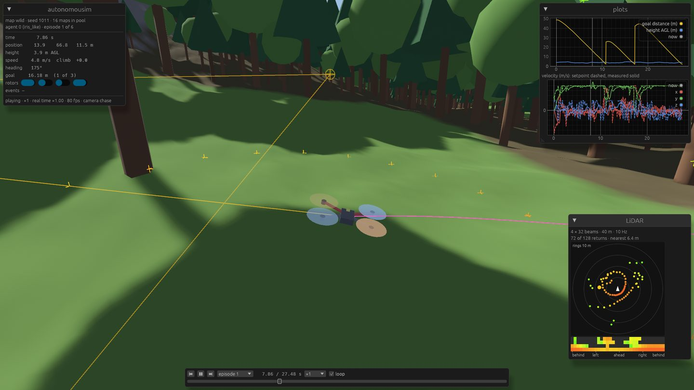
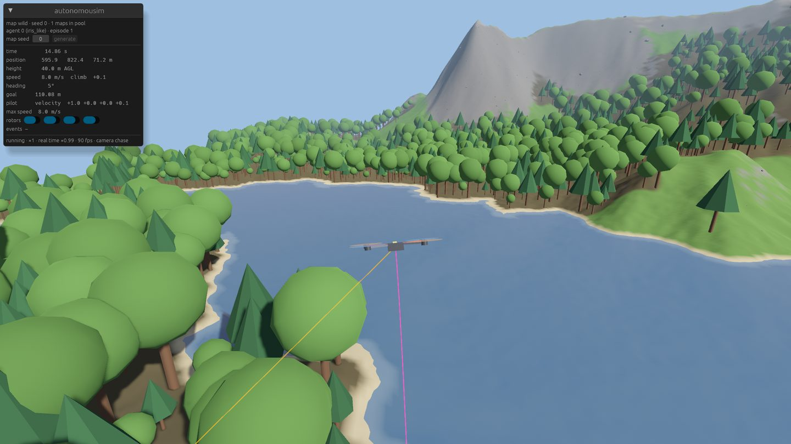

# autonomousim

A 3D simulator for training control policies for autonomous vehicles: drones and wheeled
ground vehicles. It has a deterministic Rust physics core, procedurally generated worlds, a
batched Gymnasium API for reinforcement learning, and a native Bevy viewer that replays
recorded episodes bit for bit.



## Status

**Milestone 1 (quadrotor in a wild map) is done**, from the dynamics through to a trained
policy replayed in the viewer:

- **Physics**: our own Featherstone multibody dynamics (ABA/RNEA/CRBA, checked against
  Pinocchio) with penalty contacts and friction. It uses f64 throughout and is bit-for-bit
  deterministic.
- **Multirotors**: motor lag, rotor drag, ground effect, gyroscopic terms, wind with Dryden
  turbulence and gusts. There are two presets: a Crazyflie (`cf2x`) and a 1.5 kg quad
  (`iris_like`).
- **Control**: a PX4-style cascade and control allocation. Policies act in one of five modes:
  `motors`, `ctbr` (thrust + body rates), `attitude`, `velocity` or `position`.
- **Sensors**: IMU, GPS, barometer, magnetometer, rangefinder, raycast LiDAR and ground truth.
  They model noise, bias and latency.
- **Worlds**: generated wild maps with terrain, erosion, lakes and scattered trees and rocks.
  Their hashes are reproducible, and they are cached on disk.
- **Python API**: native vector environments (`gym.make_vec`) that step many worlds in
  parallel in Rust, at 360k–450k environment steps/s on a laptop CPU.
- **Training**: CleanRL-style PPO and SAC scripts. A PPO policy for **QuadWaypointForest-v0**
  (fly through three waypoints under the treetops using LiDAR) reaches **88 % success on
  unseen maps** after 45 minutes of training on a laptop.
- **Recording and viewer**: episodes are written to MCAP files, which also open in Foxglove.
  The viewer flies live from the keyboard or a gamepad, or replays recordings with a scrubber.
  It has plots, a LiDAR view, cameras, and quality presets that reach ≥ 60 fps on an Intel
  Iris Xe.

Trained policies also fly inside the viewer, without Python: an exported network runs in Rust,
and you can take over any drone from the keyboard.

**Milestone 2 (ground vehicles I) is done**:

- **Vehicle dynamics**: Magic Formula 6.1/6.2 tyres (`.tir` files, combined slip, relaxation
  length, low-speed damping), suspension kinematics and compliance, steering, engine maps with
  an automatic gearbox or electric motors, open/limited-slip/locked differentials and brakes. Handling (ISO 4138 constant
  radius, ISO 7401 step steer, ISO 3888-1 lane change, straight braking) is checked against
  Project Chrono.
- **Vehicles**: a sedan (`sedan_like`), an off-road 4×4 (`offroad_4x4`) and two rovers
  (`rover_diff`, `rover_skid`). They drive in `raw`, `vk` (speed + path curvature), `vw`
  (speed + yaw rate) or `per_wheel` mode, at 1 kHz physics, on generated `offroad` maps.
- **Viewer**: drive from the keyboard or a gamepad, with tyre force plots and per-wheel
  telemetry; recorded drives replay with their wheels.
- **Training**: a PPO policy for **CarWaypointOffroad-v0** (drive the 4×4 through three
  waypoints between the trees using LiDAR) reaches **82 % success on unseen maps**.

**Milestone 3 (multi-agent) is done**: a native multi-agent vector env with arrays per agent
group (mixed air and ground teams), a PettingZoo `ParallelEnv`, neighbour observations,
256-drone swarms faster than 20× real time, IPPO (`examples/ppo_multiagent.py`) and the
`SwarmHover-v0` and `SwarmWaypointForest-v0` tasks.

**Milestone 4a (rural maps) is done**: generated farmland with a paved road, gravel roads to
the farms and dirt tracks to the fields, blended into the terrain; fields, farm buildings,
hedges, fences and tree lines; spawns in a lane and goals along a route over the road network,
with lane-following observations. In the viewer (`--map rural`) the roads carry lane markings.
**RoadFollowRural-v0** (a car follows its route to a farm yard, keeping to its lane) reaches
**83 % success on unseen maps** after 14 minutes of training.

**Milestone 4b (trucks and trailers) is done**: articulated vehicles as chains of units
(fifth wheel, drawbar, dolly), truck presets (6×4 tractor, 3-axle semitrailer, 8×8, farm
tractor and trailer) validated against Chrono, jackknife events and articulation observations,
sensors on trailers, and trailers in the viewer with a reversing camera. **TrailerReverse-v0**
backs the semitrailer into a bay in a farm yard; a scripted reversing controller parks 90 % of
the rigs.

**Milestone 4c (tracked vehicles and soft soil) is done**: track running gear with shear along
the band, soft soil after Bekker and Janosi–Hanamoto (sinkage, compaction, bulldozing), a
tracked APC with a torque converter and regenerative steering, validated against Chrono's M113
(Chrono runs offline only, to generate the committed fixtures), rural drainage ditches, and
soil-weighted path planning. **TrackedCrossCountry-v0** drives the APC along a planned path
through off-road waypoints across fields, soft soil and ditches; a scripted path follower
finishes about three in four episodes.

**Milestone 5 (bicycles and motorcycles) is done**: single-track vehicles with a free
steering head, a rider whose upper body leans and whose feet come down at a stop, toroidal tyres at
large camber (Pacejka's motorcycle Magic Formula, turn slip), validated against the Whipple
bicycle benchmark; a city bicycle and a sport motorcycle; a rider controller (gain-scheduled
LQR) that balances them behind `vk`/`vw` actions, or `raw` actions for agents that balance
themselves; riders in the viewer. **MotorcycleRoadRural-v0** rides a route over the rural
roads to a farm yard; a scripted rider finishes about 85 % of the routes.

Milestones 6–8 (aircraft and large maps, camera sensors, urban maps with traffic and
pedestrians) are built too.

**Milestone 9 (ROS 2) is done**: a ROS 2 bridge (`autonomousim-ros run`, DDS via
`ros2-client`, tested against ROS 2 Lyrical in Docker) publishes `/clock`, TF, odometry, every
sensor (LiDAR as `PointCloud2`, cameras as images with camera info), traffic, pedestrians and
signals as markers, and takes `cmd_vel` commands, optionally in lockstep. Recordings export as
rosbag2 bags. The viewer attaches to a running training process and follows it live
(`stream=` in Python). See [examples/ros](examples/ros/README.md).

The full plan, the design decisions and as-built notes for every step are in
[docs/PLAN.md](docs/PLAN.md).



## Requirements

- Linux (the only platform targeted).
- Rust 1.98 (pinned in `rust-toolchain.toml`; `rustup` installs it on the first build).
- [uv](https://docs.astral.sh/uv/) for the Python side (Python 3.12+).

## Quick start

```bash
# Build the native extension into a uv venv and run all tests (Rust + Python).
make test

# Fly a drone over a generated 2 km map (WASD / Space / Shift / Q E; F1 shows all keys).
cargo run -p autonomousim-viewer --release -- --preset showcase --seed 0

# The forest scenario: two drones, LiDAR (L: hits in the scene, V: LiDAR view).
cargo run -p autonomousim-viewer --release -- --scenario assets/scenarios/forest.toml

# Drive a 4×4 over an off-road map (W/S pedal, A/D steering, Space handbrake).
cargo run -p autonomousim-viewer --release -- --preset offroad --vehicle offroad_4x4

# Farmland: a sedan in its lane with a route to a farm (--demo drives it).
cargo run -p autonomousim-viewer --release -- --map rural --vehicle sedan_like

# Ride a motorcycle (W/S speed, A/D lean into a turn, Space stop).
cargo run -p autonomousim-viewer --release -- --map rural --vehicle motorcycle_sport
```

### Python

```python
import gymnasium as gym
import autonomousim  # registers the environments

envs = gym.make_vec("autonomousim/QuadHover-v0", num_envs=256, num_threads=8, seed=0)
obs, info = envs.reset()
obs, reward, terminated, truncated, info = envs.step(envs.action_space.sample())
```

Registered tasks: `QuadHover-v0`, `QuadRecover-v0`, `QuadWaypointForest-v0`,
`CarWaypointOffroad-v0`, `RoadFollowRural-v0`, `TrailerReverse-v0`, `TrackedCrossCountry-v0` and
`MotorcycleRoadRural-v0`; for several agents `SwarmHover-v0` and
`SwarmWaypointForest-v0` (`autonomousim.multiagent.MultiAgentVectorEnv(num_envs, "swarm_hover")`
or `autonomousim.pettingzoo.parallel_env`). Task options such as `action_mode`, `map_seed` or reward weights are
passed as keyword arguments.

Camera sensors render RGB, depth and semantic images on the GPU (headless wgpu; all worlds of a
batch in one submission). A task with camera observation terms observes a `Dict`
`{"state": float32 [obs_dim], "image": uint8 [H, W, C]}`, e.g. `QuadHoverPad-v0` (hover over a
landing pad seen by a downward camera) and `DroneLandOnCar-v0` (find a car driving on rural
roads with a downward camera, follow it and land on its roof; with `semantic=True`,
`task.scripted(obs)` does so from the image alone in about two thirds of the episodes), trained
with `examples/ppo_pixels.py` (a small CNN encoder). `AUTONOMOUSIM_RENDER_ADAPTER` picks the GPU (`auto`, `software` for Mesa's lavapipe,
or part of an adapter name). In the viewer, I opens the followed agent's camera image (K cycles
RGB, depth and classes) with its frustum, live and in replays (try `--scenario
assets/scenarios/traffic_camera.toml --demo --camera-view`); recordings keep the images with
`camera_hz` (`eval_record.py --camera-hz 10`).

Scripted groups drive themselves: a ground-vehicle group spawned `on_road` with
`driver = { type = "road" }` drives random routes over the road network (pure pursuit in its
lane, slowing for bends and the traffic ahead, K-turns at dead ends and map edges). Such
groups take no actions and have no arrays in the Python environments; a drone that lands on
a moving car reports `LANDED` with the car's index in the state column `support`.

### Train, record, replay

```bash
make train-deps   # CPU PyTorch + TensorBoard

uv run python examples/ppo_continuous.py --env-id autonomousim/QuadWaypointForest-v0 \
    --total-timesteps 30000000 --hidden 256 --torch-threads 6 --bound-coef 0.01 \
    --eval-env-kwargs '{"map_seed": 1000}' --eval-episodes 512
uv run python examples/eval_record.py runs/<run>/policy.pt --episodes 6 --lidar \
    --env-kwargs '{"map_seed": 1000}'
cargo run -p autonomousim-viewer --release -- replay recordings/<run>.mcap --lidar-view

# Fly the policy live in the viewer on new maps (T takes over the followed drone).
uv run python examples/export_policy.py runs/<run>/policy.pt
cargo run -p autonomousim-viewer --release -- policy runs/<run>/policy.json --agents 4 --lidar-view
```

Watch a training run live: any environment streams its world 0 with `stream=`, and the viewer
attaches mid-run, follows resets, and reconnects if the run restarts. Throughput drops by about
1 %:

```bash
uv run python examples/ppo_continuous.py --env-kwargs '{"stream": "127.0.0.1:7447"}' 
cargo run -p autonomousim-viewer --release -- attach 127.0.0.1:7447
```

`eval_record.py` checks that the recording reproduces every recorded state bit for bit when
re-simulated from the file. The viewer relies on this for replay.

Pixel policies work the same way: `ppo_pixels.py` exports its CNN encoder with the MLP, the
viewer runs it in Rust on the camera images (matching PyTorch within 1e-5), and
`autonomousim._native.Policy` runs an exported file from Python:

```bash
uv run python examples/ppo_pixels.py --total-timesteps 1500000     # QuadHoverPad-v0, ~11 min
cargo run -p autonomousim-viewer --release -- policy runs/<run>/policy.json --camera-view
```

## Layout

| Path | Contents |
|---|---|
| `crates/core` | Spatial math, multibody dynamics, contacts, seeded RNG, time |
| `crates/world` | Height grids, static worlds (terrain, obstacles, water), atmosphere, wind |
| `crates/procgen` | Noise, erosion, hydrology, biomes, scatter; the wild map generator and cache |
| `crates/vehicles` | Vehicle definitions (TOML), multirotor and wheeled-vehicle models, tyres |
| `crates/control` | Multirotor cascade, allocation, ground-vehicle controllers, action modes |
| `crates/sensors` | IMU, GPS, baro, mag, rangefinder, LiDAR, camera |
| `crates/sim` | Worlds, agents, scenarios, observations, batched simulation, MCAP recording, policy playback |
| `crates/scene` | Renderer-independent meshes (terrain chunks, vegetation, vehicles) |
| `crates/render` | Headless wgpu renderer for camera sensors (RGB, depth, semantic classes) |
| `crates/py` | Python bindings (`autonomousim._native`, PyO3) |
| `crates/viewer` | The Bevy viewer (live, replay and trained policies) |
| `crates/cli` | `autonomousim mapgen / map-hash / map-info / version` |
| `python/autonomousim` | Gymnasium environments, tasks, RL helpers, benchmarks |
| `crates/ros` | ROS 2 bridge and rosbag2 export (`autonomousim-ros run / bag`) |
| `examples/` | PPO, SAC, evaluation and recording, policy export; `examples/ros/` the ROS 2 example |
| `tools/ros/` | The ROS 2 container harness (`run.sh`) and its helper nodes |
| `assets/` | Vehicle presets and scenarios |
| `docs/PLAN.md` | Architecture, roadmap and as-built notes |

## Development

| Command | What it does |
|---|---|
| `make check` | `rustfmt` + `clippy -D warnings` on the whole workspace |
| `make test` | Rust tests + Python tests |
| `make test-viewer` | The viewer's headless tests (builds Bevy) |
| `make bench` | Criterion benchmarks + Python throughput benchmark |
| `make test-ros` | ROS 2 interop tests in Docker (`ros:lyrical-ros-base`), the ROS example included |

`cargo` lives in `~/.cargo/bin`. If your shell doesn't have it on `PATH`, run
`source ~/.cargo/env` (the Makefile adds it itself).

## License

[MIT](LICENSE)
